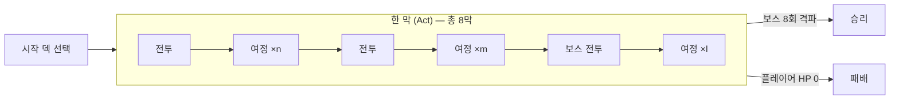
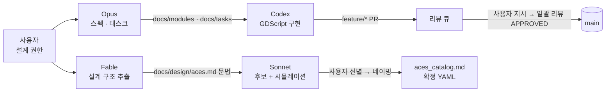

<div align="center">

# Closejack

**블랙잭을 재해석한 2D 로그라이크 덱빌딩 카드 게임**
*A roguelike deckbuilder built on a two-hand blackjack variant — Godot 4.6 / GDScript*


</div>

> 두 개의 핸드(**레드 · 블루**)를 각각 21에 가깝게 쌓아, 두 핸드 **가치의 곱**으로 적을 공격한다.
> 무게를 정확히 21에 맞추면 **황금 칩**이 쌓이고, 양쪽 모두 맞추면 게임 이름과 같은 **클로즈잭(closejack)** 이 된다.

---

## 한눈에 보기

| 항목 | 내용 |
|---|---|
| 장르 | 싱글플레이어 로그라이크 덱빌더 (블랙잭 변형, PvE) |
| 엔진 / 언어 | Godot 4.6 (Forward+) · GDScript, 정적 타이핑 100% |
| 플랫폼 | Steam (Windows) |
| 지원 언어 | 한국어 · 영어 (현지화 전제 — 표시 문자열 하드코딩 금지) |
| 개발 형태 | 1인 개발 (기획 · 설계 · 구현) + **AI 에이전트 협업 하네스** 설계·운영 |
| 현재 단계 | 게임 룰 설계 확정 + 핵심 로직 모듈 구현 (pre-alpha) · 2026.06 ~ |
| 테스트 | GUT 9.6 · 유닛 테스트 **16개 / 71 asserts 통과** (헤드리스) |

## 목차

1. [게임 컨셉](#1-게임-컨셉)
2. [기술 스택 & 설계 원칙](#2-기술-스택--설계-원칙)
3. [구현 현황](#3-구현-현황)
4. [개발 프로세스 — AI 에이전트 협업 하네스](#4-개발-프로세스--ai-에이전트-협업-하네스)
5. [프로젝트 구조](#5-프로젝트-구조)
6. [시작하기](#6-시작하기)
7. [문서](#7-문서)
8. [로드맵](#8-로드맵)

---

## 1. 게임 컨셉

### 핵심 루프



- **라운드** = 한 전투(누군가 쓰러질 때까지), **턴** = 나와 적의 상호행동 단위.
- 매 전투는 **적 2지선다**로 시작한다. 한쪽은 약 30% 더 강하고, 그만큼 **여정 횟수와 금화**를 더 준다.

### 카드 3종 — 모든 카드는 "무게"와 "가치"를 분리해서 가진다

| 종류 | 역할 | 배치 |
|---|---|---|
| **플레잉 카드** | 핸드를 구성하는 기본 카드. 무게 · 가치 · 중앙 그림(효과, 없을 수도 있음) | 덱 → 레드/블루 핸드 |
| **홀 카드** | 일회성 아이템. 카드 자리 교환, 뒤집기, 덱 상단 확인 등 | 우하단 3슬롯 |
| **에이스** | 영구 강화 카드(발라트로의 조커에 대응). 가치 없음, **무게 한도 5** 안에서 적재 | 좌측 세로 슬롯 |

> **왜 무게와 가치를 분리했나** — 블랙잭의 "숫자 하나"를 두 축으로 쪼개면 카드 풀이 폭발적으로 넓어진다.
> 무게 3 · 가치 20인 카드, 무게를 늘리는 대신 효과를 주는 카드, 핸드 전체 무게를 줄이는 대신 자기 가치를 희생하는 카드 등이 모두 가능해진다.

### 핸드 · 버스트

- 레드/블루 핸드 각 **5슬롯**, **왼쪽부터** 채운다. 무게 한도 기본 **21**.
- 히트 후 무게가 21을 넘으면 **버스트** — 그 핸드는 **3번(중앙) 슬롯만 유효**하고 나머지는 무너진다. 턴이 끝날 때까지 복구되지 않는다.
- 히트 시 효과 발동 순서: 레드 핸드 좌→우 → 블루 핸드 좌→우 → 에이스 위→아래. 에이스는 드래그로 순서를 바꿀 수 있어 **적재 순서 자체가 자원**이 된다.

### 황금 칩 (Golden Chip) — 스탠드 시점 판정, 기본 최대 6개

| 명칭 | 조건 | 칩 |
|---|---|---|
| **redjack** / **bluejack** | 해당 핸드의 유효 무게가 최대 무게(21)와 **정확히** 같음 | 각 1 |
| **red guys** / **blue guys** | 해당 핸드 **5슬롯 만석** | 각 1 |
| **closejack** | redjack + bluejack 동시 달성 (게임 타이틀) | 추가 1 |
| **full guys** | red guys + blue guys 동시 달성 | 추가 1 |

- 버스트된 핸드도 중앙 카드의 무게가 정확히 21이면 -jack으로 인정된다 → **고의 버스트(WRECK) 빌드**의 근거.
- 만석 칩은 버스트 핸드에서 절대 불가. 칩은 스탠드마다 리셋되어 **매 스탠드 재달성 엔진**이 된다.

### 데미지 공식

```
데미지 = 레드 가치 × 블루 가치 × 1.5^(황금 칩 수)      ※ 소수점은 최종에서 버림
```

예) 레드 가치 12 · 블루 가치 10, redjack + bluejack 달성(→ closejack까지 칩 3개)
`12 × 10 × 1.5³ = 405`

- 두 핸드가 **곱**으로 묶이므로 한쪽만 키우는 빌드는 함정이다. 에이스 군(群) 설계에서 반대 레인 **Stabilizer**를 필수로 두는 이유.
- 가치는 음수가 될 수 있다. 한쪽만 음수면 데미지 0, **양쪽 모두 음수면 곱이 양수**로 인정 → `NEGATIVE` 아키타입.

### 플레이어 동작 6종

| 동작 | 설명 |
|---|---|
| 레드 히트 / 블루 히트 | 덱 상단 카드를 해당 핸드로 드래그. 히트는 턴을 넘기지 않는다 |
| 스탠드 | 양 핸드에 1장 이상 있을 때 확정 → 데미지 계산 → 적 생존 시 적 행동 |
| 홀 카드 사용 | 일회성 아이템 (희귀도에 따라 라운드/턴당 재사용) |
| 판 엎기 (Table Flip) | 라운드당 1회. 이 턴을 무효화하되 적 계획은 유지, 대가로 **이 라운드 적 공격력 ×2** |
| 덱 보충 | 그 턴 0장 히트 상태에서만 버린 더미를 덱으로 되돌려 셔플. 턴을 포기하는 행위 → **극단적 덱 압축 견제** |

### 여정 (Journey) 시스템

전투 사이의 성장 구간. 매 단계 **두 여정 중 하나**를 고르고, 진입한 여정이 자기 선택지를 제시한다(중첩 없음).

| 여정 | 내용 |
|---|---|
| 상인 (에이스/플레잉/홀) | 금화로 3개 중 1개 구매 |
| 후원자 (에이스/플레잉/홀) | 무료 1개 |
| 보물 더미 · 온천 | 금화 · 체력 회복 (스킵 불가) |
| 모닥불 | 카드 소각 (기본 1장) |
| 화가 | 덱에서 7장 뽑아 1장에 그림(효과) 부여 |
| 아르카나 | 타로 카드로 보유 카드 변형 (복사/제거/특수) |
| 동굴 | 위 전부 + 체력 손실 이벤트 중 무작위 |

여정에는 **수식어**가 붙는다 — 수량군(**풍요로운** +2 / **궁핍한** −1)과 희귀도군(**희귀한** / **찬란한** / **광기의** = 최고 희귀도이지만 가려진 상태)에서 각 하나씩 결합 가능.

---

## 2. 기술 스택 & 설계 원칙

| 영역 | 선택 | 비고 |
|---|---|---|
| 엔진 | **Godot 4.6** (Forward+, D3D12) | 2D 카드 게임, Steam Windows 타겟 |
| 언어 | **GDScript** | 모든 변수·반환 타입 정적 타이핑, Godot 4.x API만 사용 |
| 테스트 | **GUT 9.6.0** | 헤드리스 CLI 실행, PR 전 필수 통과 |
| 로깅 | `Logger` 오토로드 | `print()` 금지, 레벨별 출력 |
| 코드베이스 맵 | **graphify** 지식 그래프 | AST + 시맨틱 그래프를 git에 커밋해 에이전트 간 공유 (90 노드 / 290 엣지) |
| 협업 | GitHub PR 템플릿 · 리뷰 체크리스트 | `feature/*` → PR → 리뷰 → `main` |

### 설계 원칙

- **순수 로직과 표현의 분리** — `Card`(Resource) · `Deck` · `Hand`(RefCounted)는 노드·씬·오토로드에 의존하지 않는다. 그래서 에디터 없이 헤드리스로 전량 테스트할 수 있다.
- **재현 가능한 무작위성** — `Deck`은 내부 `RandomNumberGenerator`를 시드로 고정할 수 있어, 같은 시드 = 같은 드로우 순서를 테스트로 보증한다.
- **스펙 우선** — 모든 모듈은 `docs/modules/<module>.md`에 공개 API · 불변 조건 · 수용 기준이 먼저 정의되고, 구현은 그 스펙과 **정확히** 일치해야 리뷰를 통과한다.
- **설계 결정은 코드에 두지 않는다** — 게임 룰·수치는 GDD(`docs/KO_설계도.md`)에만 존재하고, 미확정 룰은 구현하지 않는다(`[확인 필요]` 태그).

### 코드 맛보기 — `Hand`

```gdscript
var hand: Hand = Hand.new()          # 무게 한도 21, 5슬롯
hand.add_card(make_card(10, 8))      # (무게, 가치)
hand.add_card(make_card(11, 6))

hand.is_exact_weight()               # true  → redjack 조건
hand.effective_value()               # 14

hand.add_card(make_card(5, 100))     # 총 무게 26 → 버스트
hand.is_bust()                       # true
hand.effective_value()               # 100  → 중앙(3번) 슬롯 카드만 유효
```

---

## 3. 구현 현황

| 모듈 | 파일 | 타입 | 역할 | 테스트 | 상태 |
|---|---|---|---|---|---|
| `Card` | `scripts/logic/card.gd` | Resource | 무게 · 가치 · 종류 · 그림 ID, 독립 복사 | 3 | ✅ 리뷰 승인 · 머지 |
| `Deck` | `scripts/logic/deck.gd` | RefCounted | 드로우/버린 더미, 시드 RNG 무작위 드로우, Fisher–Yates 리셔플 | 4 | ✅ 리뷰 승인 · 머지 |
| `Hand` | `scripts/logic/hand.gd` | RefCounted | 5슬롯 좌측 채움, 무게/가치 합, exact · bust 판정, 버스트 붕괴 값 | 9 | ✅ 리뷰 승인 · 머지 |
| `Logger` | `scripts/core/logger.gd` | Autoload | 레벨별 로깅 (`print()` 대체) | – | ✅ |
| `ScoringEngine` | – | – | 두 핸드 결합 × 황금 칩 배수, 음수 규칙 | – | 📝 설계 블로커 해소, 스펙 대기 |

모든 구현은 `feature/<module>` 브랜치 → PR → 리뷰(**APPROVED**) → `main` 머지 절차를 거쳤다.
완료 태스크 기록: [`docs/tasks/done/`](docs/tasks/done/)

---

## 4. 개발 프로세스 — AI 에이전트 협업 하네스

이 프로젝트의 또 하나의 산출물은 **1인 개발자가 여러 AI 에이전트를 역할별로 지휘하는 개발 하네스**다.
"AI에게 게임을 만들게 한다"가 아니라, **설계 권한은 사람이 독점**하고 에이전트는 각자 좁은 트랙에서만 움직이도록 문서·훅·권한 경계를 설계했다.

### 역할 분리 (사용자 = 유일한 설계 권한)

| 에이전트 | 역할 | 금지 사항 |
|---|---|---|
| **Claude Fable 5** (A0) | 총괄 · 데이터 설계 구조 추출(`docs/design/`) · 스펙/리뷰/구현 | 게임 디자인 발명 |
| **Claude Opus** (A1) | GDD 유지, 모듈 스펙, 태스크 발행, **사용자 지시 시** 일괄 PR 리뷰 | 구현 코드 작성, 자발적 리뷰 |
| **OpenAI Codex** (A2) | 모듈 스펙대로 GDScript 구현 — **이것만** | 카드 생성, 설계 결정 |
| **Claude Sonnet** (A3) | 카드 후보 생성 · 네이밍 · 시뮬레이션 · 확정 YAML | 사용자 승인 전 커밋, 문법 수정 |

### 두 개의 트랙



**하네스가 강제하는 것들**

- **컨텍스트 최소화** — 각 에이전트는 진입 문서 하나에서 시작해 자기 트랙 문서만 읽는다(예: Codex는 `AGENT.md` + 모듈 스펙 1개). 프로젝트가 커져도 에이전트 컨텍스트는 커지지 않는다.
- **피드백 채널** — 스펙이 모호하면 추측하지 않고 `docs/feedback/`에 질문을 남기고 멈춘다. 리뷰어가 스펙을 고친 뒤 재개.
- **승인 게이트** — 카드 생성 초안은 사용자가 선별하기 전까지 커밋·PR 금지. 문법 문서(`aces.md`)는 사용자 승인 후 변경 금지.
- **리뷰 체크리스트** — 스펙 일치 · 정적 타이핑 · 네이밍 · `print()` 금지 · 시그널 위생 · 수용 기준 전항목을 PR 템플릿과 리뷰 프로토콜로 고정.
- **지식 그래프 우선** — 원본 파일을 grep하기 전에 graphify 그래프를 먼저 질의하도록 `PreToolUse` 훅이 유도하고, 세션 시작 시 기획 백로그를 강제로 노출한다.

### 데이터 기반 카드 설계 — 에이스 생성 문법 v3

에이스(영구 강화 카드)는 하나씩 손으로 짓지 않고, **문법을 먼저 정의하고 그 문법으로 대량 생성**한다.

- **26개 아키타입**(덱빌딩 방향) × 발동(T) · 조건(S) · 효과(E) · 성장(G) · 구조(P) · 미션(M) 축의 조합 문법
- 세기는 절대 수치가 아닌 **칩 등가(CE)** 로 기록 — 칩 1개 = ×1.5이므로 CE 합 = 배수 곱
- **군(群) 구성 원칙**: Enabler → Payoff → 반대 레인 Stabilizer (→ 2차 Payoff). 곱셈 데미지 구조 때문에 한 레인만 키우는 군은 함정
- 금지 조합 F1~F15, 데미지 파이프라인 D0~D9(레드 → 블루 → 에이스 발동층 / 적용 단계 분리)
- 영구 성장은 **선형 + 적용 조건 필수**, 군 단위 배수 예산(MP), 런별 군 로테이션 — "정해(正解) 조합" 방지 3중 장치

**시뮬레이션으로 검증** — Redjack 군의 Enabler 후보(부족분 1~3을 접어 넣어 정확히 21을 만드는 에이스)를 1~10 카드 3벌(30장) 덱에서 **100,000회** 드로우 시뮬레이션:

| 스탠드 기준 | 기준: 레드 21 | Enabler 보유: 레드 21 | 기준: 양쪽 21 | Enabler 보유: 양쪽 21 |
|---:|---:|---:|---:|---:|
| 18 | 11.72% | **59.69%** | 1.38% | 6.97% |
| 21 | 16.20% | **59.64%** | 2.54% | 9.55% |

→ 카드 하나가 빌드 정체성(Red-exact)을 만들 만큼 강하다는 근거를 숫자로 확보한 뒤 군 설계를 진행했다.
상세: [`docs/design/aces_items.md`](docs/design/aces_items.md)

---

## 5. 프로젝트 구조

```
Closejack/
├── project.godot               # Godot 4.6 · Logger 오토로드 · GUT 플러그인
├── scripts/
│   ├── core/logger.gd          # Logger 오토로드
│   ├── logic/                  # 순수 게임 로직 (노드/씬 의존 없음)
│   │   ├── card.gd             #   Card   — Resource
│   │   ├── deck.gd             #   Deck   — RefCounted, 시드 RNG
│   │   └── hand.gd             #   Hand   — RefCounted, 5슬롯 · 버스트
│   ├── systems/                # (예정) GameManager · AudioManager · SaveSystem
│   └── ui/
├── scenes/  (game/ ui/ cards/) # 룰 확정 후 작성
├── tests/unit/                 # GUT 유닛 테스트 (test_card · test_deck · test_hand)
├── assets/  (sprites/ fonts/ audio/)
├── addons/gut/                 # GUT 9.6.0
├── docs/
│   ├── KO_설계도.md             # 게임 설계도(GDD) — 설계의 유일한 원본
│   ├── PLANNING_TODO.md        # 기획 백로그 (매 세션 갱신)
│   ├── AGENT_COLLABORATION.md  # 스펙/태스크/PR/리뷰 포맷, 코딩 규약
│   ├── ASSET_WORKFLOW.md       # 이미지 자산 제작 프로세스
│   ├── design/                 # 에이스 생성 문법 · 초안/시뮬레이션 · 확정 카탈로그
│   ├── modules/                # 모듈 스펙 (card · deck · hand)
│   ├── roles/                  # 에이전트 진입 문서
│   ├── tasks/  (pending/ done/ superseded/)
│   └── feedback/               # 에이전트 → 리뷰어 질문 채널
├── graphify-out/               # 코드베이스 지식 그래프 (커밋됨)
├── CLAUDE.md · AGENT.md · AGENTS.md   # 에이전트 하네스 진입점
└── .github/pull_request_template.md
```

---

## 6. 시작하기

**요구 사항**: [Godot 4.6](https://godotengine.org/) (검증 버전 4.6.3), `godot` 실행 파일이 PATH에 있어야 헤드리스 명령을 쓸 수 있다.

```bash
git clone https://github.com/junyoung449/Closejack.git
cd Closejack
```

Godot 에디터에서 `project.godot`을 열거나, 헤드리스로 임포트·검증:

```bash
godot --headless --path . --editor --quit-after 2
```

유닛 테스트 실행 (GUT):

```bash
godot --headless --path . -s addons/gut/gut_cmdln.gd -gdir=res://tests -ginclude_subdirs -gno_error_tracking -gexit
```

> GUT 종료 시 출력되는 `ObjectDB instances leaked at exit` 류의 메시지는 프레임워크 정리 노이즈다. `All tests passed`가 기준.

---

## 7. 문서

| 문서 | 내용 |
|---|---|
| [docs/KO_설계도.md](docs/KO_설계도.md) | **게임 설계도(GDD)** — 룰 · 보드 · 여정 · 데미지 공식 · 변경 이력 |
| [docs/PLANNING_TODO.md](docs/PLANNING_TODO.md) | 기획 백로그 — 확정된 것 / 채워야 할 것 / 에이전트 진행 현황 |
| [docs/design/aces.md](docs/design/aces.md) | 에이스 생성 문법 v3 (26 아키타입, CE/MP, 파이프라인, 금지 조합) |
| [docs/design/card_generation_rules.md](docs/design/card_generation_rules.md) | 카드 생성 워크플로우 + 게임 룰 브리핑 |
| [docs/design/aces_items.md](docs/design/aces_items.md) · [aces_catalog.md](docs/design/aces_catalog.md) | 에이스 후보 초안 · 시뮬레이션 / 확정 YAML |
| [docs/modules/](docs/modules/) | 모듈 스펙 — `card.md` · `deck.md` · `hand.md` |
| [docs/AGENT_COLLABORATION.md](docs/AGENT_COLLABORATION.md) | 스펙 · 태스크 · PR · 리뷰 프로토콜, GDScript 규약, 금지 패턴 |
| [CLAUDE.md](CLAUDE.md) · [AGENT.md](AGENT.md) · [docs/roles/card_generation.md](docs/roles/card_generation.md) | 에이전트별 진입 문서와 권한 표 |

---

## 8. 로드맵

**완료**
- [x] 게임 큰 틀 확정 — 8막 구조, 적 선택, 여정 8종 + 수식어, 전투 보드, 플레이어 6동작
- [x] 핸드 · 버스트 · 황금 칩 6조건 · 데미지 공식(음수 규칙 포함) 확정
- [x] 에이스 시스템 상세 확정 + 생성 문법 v3 사용자 승인 (26 아키타입)
- [x] `Card` · `Deck` · `Hand` 모듈 구현 및 리뷰 승인 (GUT 16/16)
- [x] AI 에이전트 협업 하네스 구축 (역할 · 트랙 · 훅 · 지식 그래프)

**진행 중**
- [ ] Redjack(`RED-EXACT`) · Bluejack(`BLUE-EXACT`) 에이스 군 초안 → 사용자 선별 → 확정 카탈로그
- [ ] 플레잉 카드 그림(효과) 풀 데이터 구조 추출

**예정**
- [ ] `ScoringEngine` — 두 핸드 결합 · 황금 칩 배수 · 음수 처리 (설계 블로커 해소 상태)
- [ ] 전투 컨트롤러 — 턴 · 스탠드 · 덱 보충 규칙 · 판 엎기 · 전투 덱 복사본(일시/영구 변경 분리)
- [ ] 시작 덱 · 홀 카드 풀 · 적/보스 패턴 · 타로(아르카나) 풀
- [ ] 여정 수치 · 경제 · 밸런스 (카드 풀 견적 확정 후 착수 — 임의 수치 선행 금지 원칙)
- [ ] 메타 진행(군 단위 해금) · 현지화 키 체계 · UI/아트/오디오 방향

---

<div align="center">

개발: [junyoung449](https://github.com/junyoung449) · 테스트 프레임워크 [GUT](https://github.com/bitwes/Gut) (MIT)

</div>
